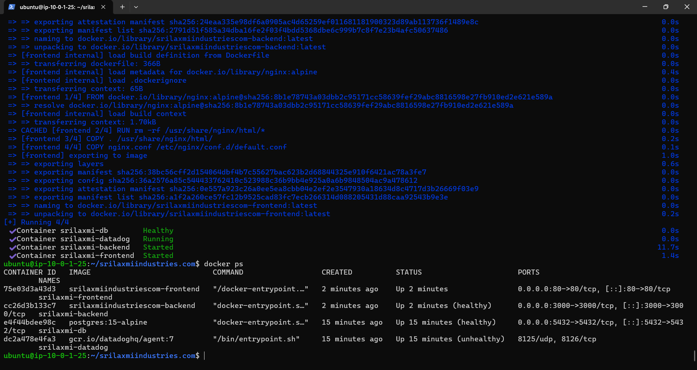
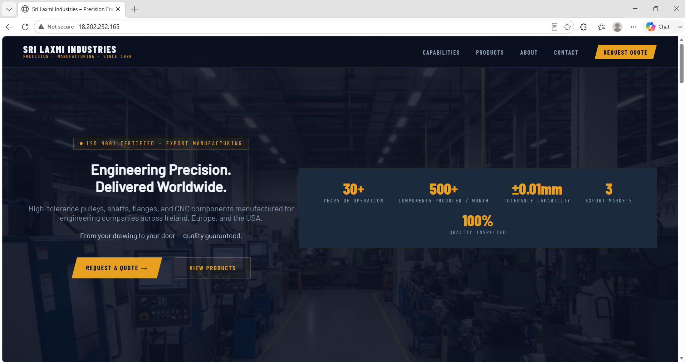
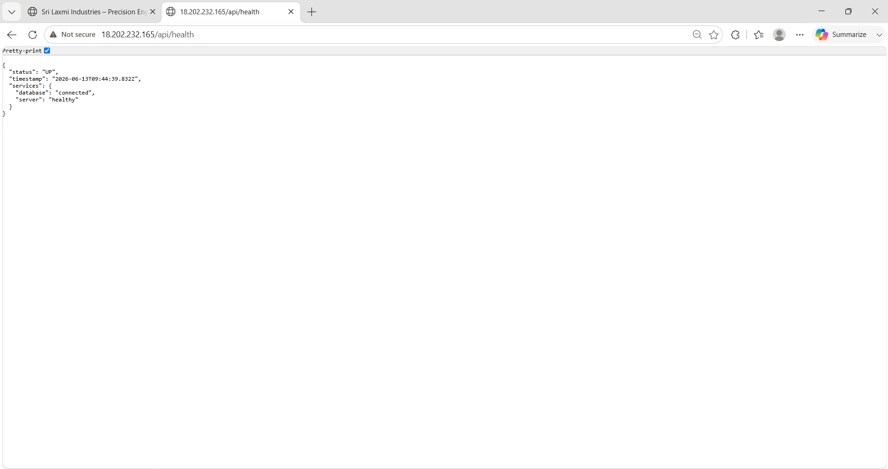
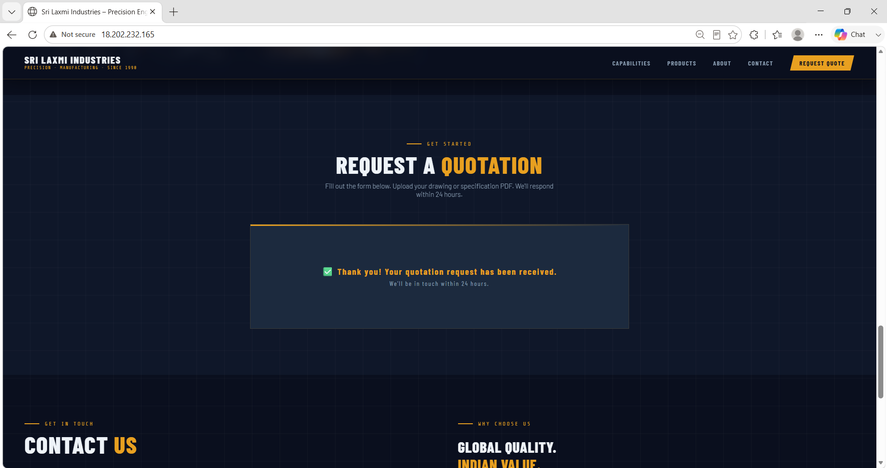
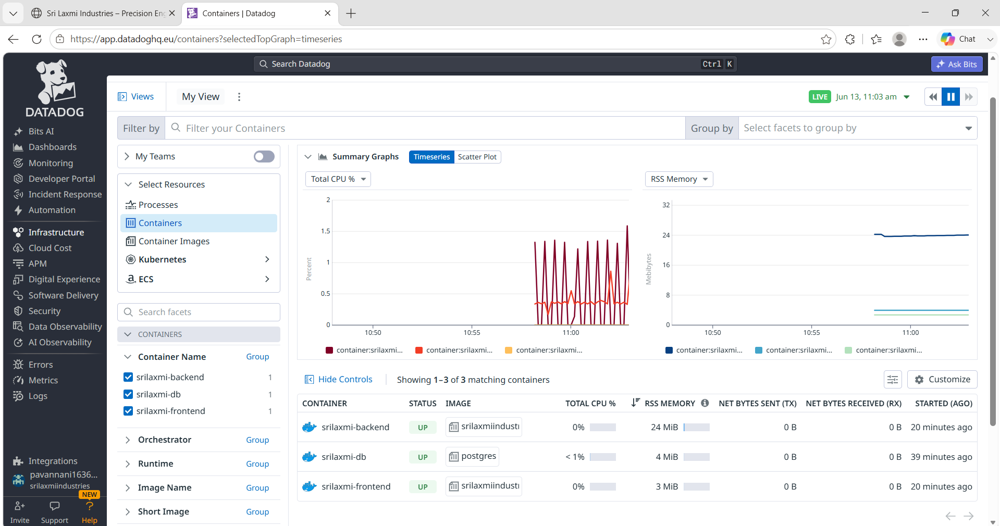

# 🏭 Sri Laxmi Engineering Works — B2B Manufacturing Cloud Platform

🚀 **Live Production Environment:** **[https://srilaxmiindustries.com](https://srilaxmiindustries.com)**

[](https://srilaxmiindustries.com)

[](./terraform)
[](./docker-compose.yml)
[](./terraform)
[](./.github/workflows/deploy.yml)
[](./datadog)
[](./backend)

---

## 📋 Table of Contents

- [What Is This Project?](#what-is-this-project)
- [Infrastructure Architecture](#infrastructure-architecture)
- [Terraform File Layout](#terraform-file-layout)
- [CI/CD Pipeline](#cicd-pipeline)
- [Monitoring & Observability](#monitoring--observability)
- [Project Structure](#project-structure)
- [API Endpoints](#api-endpoints)
- [Security Model](#security-model)
- [Database Backups](#database-backups)
- [What I Learned](#what-i-learned-that-actually-stuck)
- [Running Locally](#running-locally)
- [Contact](#contact)

---

## What Is This Project?

Sri Laxmi Engineering Works is a **real-world B2B precision manufacturing company** that exports engineered components (shafts, flanges, bushings, CNC parts) to international clients. This project replaces their manual enquiry process with a cloud-deployed digital platform.

The business problem was simple: potential B2B customers needed a way to submit quotation requests with technical CAD drawings attached, and the sales team needed instant email notifications with all details stored in a database — not scattered across WhatsApp messages and email threads.

So I built the platform end-to-end. But I made a deliberate decision: **this project would not stop at a working website.** It would be deployed the way a real production system is deployed — containerised, infrastructure-as-code, automated CI/CD, observability dashboards, nightly database backups, and GDPR-compliant data handling.

**Sri Laxmi Industries is my proof of what I can build and ship as a DevOps / Cloud Engineer.**

---

## Infrastructure Architecture

The production deployment runs entirely on AWS in the `eu-west-1` (Ireland) region. All infrastructure is provisioned via Terraform — no manual console clicks.

```
 ┌──────────────────────────────────────────────────────────────────────┐
 │       AWS INFRASTRUCTURE (eu-west-1) — PROVISIONED VIA TERRAFORM     │
 │                                                                      │
 │   B2B Client ──HTTP──► EC2 Instance (t3.micro)                      │
 │                              │                                      │
 │              ┌───────────────▼──────────────────┐                   │
 │              │    Docker Compose Environment     │                   │
 │              │                                   │                   │
 │              │  ┌─────────────┐                  │                   │
 │              │  │  frontend   │  Nginx:alpine     │                   │
 │              │  │  Port 80    │  Static files     │                   │
 │              │  │             │  + Reverse Proxy  │                   │
 │              │  └──────┬──────┘                  │                   │
 │              │         │ /api/* proxy_pass        │                   │
 │              │  ┌──────▼──────┐                  │                   │
 │              │  │  backend    │  Express.js       │                   │
 │              │  │  Port 3000  │  Node.js API      │                   │
 │              │  │  (non-root) │  Multer + AWS SDK │                   │
 │              │  └──────┬──────┘                  │                   │
 │              │         │ SQL queries              │                   │
 │              │  ┌──────▼──────┐                  │                   │
 │              │  │  db         │  PostgreSQL 15    │                   │
 │              │  │  Port 5432  │  Named volume     │                   │
 │              │  └─────────────┘                  │                   │
 │              │                                   │                   │
 │              │  ┌─────────────┐                  │                   │
 │              │  │  datadog    │  Agent v7         │                   │
 │              │  │  Metrics    │  Docker socket    │                   │
 │              │  └──────┬──────┘                  │                   │
 │              └─────────┼─────────────────────────┘                   │
 │                        │                                             │
 │                        ▼                                             │
 │              Datadog Cloud Dashboard                                 │
 │                                                                      │
 │   Backend ──Upload CAD/PDF──► S3 Bucket (private, versioned)        │
 │   Backend ──Send Emails────► AWS SES (owner + customer)             │
 │   Cron ─────pg_dump────────► S3 Bucket (nightly backups)            │
 │                                                                      │
 └──────────────────────────────────────────────────────────────────────┘
```

---

## Deployment Proof

Visual confirmation of the production deployment lifecycle:

<details>
<summary><b>1. Containerization (Docker)</b></summary>
<br>
All 4 services (frontend, backend, db, datadog) running healthily inside Docker Compose.
<br><br>

</details>

<details>
<summary><b>2. Live Website on AWS EC2</b></summary>
<br>
The frontend successfully served by Nginx on the public EC2 IP address.
<br><br>

</details>

<details>
<summary><b>3. API Health Check</b></summary>
<br>
The Express.js backend successfully connecting to the PostgreSQL database.
<br><br>

</details>

<details>
<summary><b>4. Email Notifications (AWS SES)</b></summary>
<br>
Automated B2B enquiry confirmation emails delivered successfully via Amazon SES.
<br><br>

</details>

<details>
<summary><b>5. Observability (Datadog)</b></summary>
<br>
Live container metrics (CPU, Memory, Network) streaming to the Datadog Cloud dashboard.
<br><br>

</details>

## Terraform File Layout

All AWS infrastructure is defined as code — reproducible and version-controlled:

```
terraform/
├── providers.tf          ← AWS provider pinned to eu-west-1
├── variables.tf          ← Region, instance type, S3 bucket names
├── outputs.tf            ← EC2 public IP output
├── vpc.tf                ← VPC, public subnet, IGW, route table
├── security_groups.tf    ← HTTP (80), HTTPS (443), SSH (22) rules
├── iam.tf                ← EC2 instance profile for S3/SES access
├── s3.tf                 ← Upload bucket + backup bucket (versioned, private)
└── ec2.tf                ← EC2 instance with Docker user data bootstrap
```

> **Why Terraform and not ClickOps?**
> Because infrastructure defined in code can be version-controlled, peer-reviewed in a PR, rolled back in one command, and recreated identically in a new environment. `terraform destroy && terraform apply` is more reliable than trying to remember what you clicked in the AWS console six months ago.

---

## CI/CD Pipeline

Automated deployment pipeline using GitHub Actions (`.github/workflows/deploy.yml`):

```
  Developer pushes to main
         │
         ▼
  ┌──────────────────────┐
  │  GitHub Actions       │
  │  Runner (ubuntu)      │
  │                       │
  │  1. Checkout code     │
  │  2. SSH into EC2      │
  │  3. git pull origin   │
  │  4. Write .env from   │
  │     GitHub Secrets    │
  │  5. docker compose    │
  │     down + up --build │
  │  6. Health check      │
  │     /api/health       │
  └──────────────────────┘
         │
    Pass: "B2B platform is UP"
    Fail: Print logs + exit 1
```

Credentials (DB passwords, AWS keys, Datadog API key) are stored as **GitHub Secrets** — never committed to the repository.

---

## Monitoring & Observability

The **Datadog Agent** runs as a fourth container inside Docker Compose. It collects:

- **Container Metrics**: CPU usage, memory consumption, network I/O per container
- **Docker Events**: Container starts, stops, restarts, OOM kills
- **Log Aggregation**: Collects stdout/stderr from all containers except itself
- **Host Metrics**: EC2 system-level CPU, disk, and memory via `/proc` and `/sys` mounts

---

## Project Structure

```
srilaxmi-devops/
├── .github/workflows/deploy.yml    ← CI/CD pipeline
├── backend/
│   ├── Dockerfile                  ← Multi-stage Node.js build (non-root)
│   ├── server.js                   ← Express API + GDPR endpoints
│   ├── db.js                       ← PostgreSQL pool + auto table creation
│   ├── upload.js                   ← S3 upload with local fallback
│   ├── mailer.js                   ← AWS SES dual email (owner + customer)
│   └── package.json
├── frontend/
│   ├── Dockerfile                  ← Nginx Alpine image
│   ├── nginx.conf                  ← Reverse proxy + client_max_body_size
│   ├── index.html                  ← Main SPA shell
│   ├── css/style.css
│   ├── js/main.js
│   ├── sections/                   ← Dynamically loaded HTML sections
│   └── images/
├── terraform/                      ← Infrastructure as Code (8 files)
├── scripts/
│   ├── backup.sh                   ← Nightly pg_dump → gzip → S3
│   └── install-cron.sh             ← Cron job installer
├── datadog/datadog.yaml            ← Agent configuration
├── docker-compose.yml              ← 4-container orchestration
├── .env.example                    ← Template environment variables
├── .gitignore
├── notes/                          ← DevOps learning documentation
└── README.md
```

---

## API Endpoints

| Method | Endpoint | Auth | Description |
|--------|----------|------|-------------|
| `GET` | `/api/health` | Public | Database connectivity check |
| `POST` | `/api/enquiries` | Public | Submit B2B quotation (file upload + SES email) |
| `GET` | `/api/enquiries/export` | Admin | GDPR data export by email |
| `DELETE` | `/api/enquiries/delete` | Admin | GDPR data deletion by email |
| `POST` | `/send-quotation` | Public | Legacy redirect → `/api/enquiries` |

---

## Security Model

| Layer | Implementation |
|-------|----------------|
| **Container Runtime** | Backend runs as non-root `node` user (USER directive) |
| **GDPR Endpoints** | Protected by `X-Admin-API-Key` header validation |
| **S3 Buckets** | All public access blocked; IAM role-based access only |
| **File Uploads** | Multer memory storage — no temp files written to disk |
| **Frontend API Calls** | Relative paths (`/api/enquiries`) — no CORS issues |
| **Secrets Management** | `.env` excluded from Git; GitHub Secrets for CI/CD |
| **SSH Keys** | `.pem` files excluded from Git via `.gitignore` |

---

## Database Backups

Automated nightly backups via `scripts/backup.sh`:

1. `pg_dump` runs inside the PostgreSQL container
2. Output is piped through `gzip` for compression
3. Compressed file is uploaded to a private S3 bucket
4. Local backups older than 7 days are automatically deleted
5. Scheduled via cron using `scripts/install-cron.sh`

---

## What I Learned (That Actually Stuck)

- **Docker Compose networking**: Containers find each other by service name (`db`, `backend`) via Docker's internal DNS — `localhost` means something different inside a container
- **Terraform state management**: Never commit `.tfstate` to Git — it contains plaintext secrets. Always run `terraform plan` before `apply`
- **Nginx reverse proxy**: Offloading static files to Nginx frees Node.js to focus on API logic. The `proxy_pass` directive routes `/api/*` to the backend container transparently
- **AWS S3 SDK**: Streaming file buffers directly from Multer memory storage to S3 — no temp files touching the server disk
- **GDPR compliance patterns**: Admin-authenticated export and delete endpoints, not public-facing. Data rights require identity verification
- **GitHub Actions SSH deployment**: Using `appleboy/ssh-action` to remote into EC2, pull code, rebuild containers, and run a health check — all triggered by a `git push`
- **Datadog container monitoring**: Mounting `/var/run/docker.sock` gives the agent visibility into all container metrics without modifying application code
- **Multi-stage Docker builds**: Build dependencies in one stage, copy only production artifacts to the final image — smaller, faster, more secure

---

## Running Locally

```bash
# 1. Clone the repository
git clone https://github.com/pavan1636/srilaxmiindustries.com.git
cd srilaxmiindustries.com

# 2. Create environment file
cp .env.example .env
# Edit .env with your database credentials and AWS keys

# 3. Start all containers
docker compose up -d --build

# 4. Verify
curl http://localhost/api/health
# Expected: {"status":"UP","services":{"database":"connected","server":"healthy"}}

# 5. Stop
docker compose down
```

---

## Contact

- **LinkedIn**: [linkedin.com/in/pavan-kumar-adusumilli-575426182](https://linkedin.com/in/pavan-kumar-adusumilli-575426182)
- **GitHub**: [github.com/pavan1636](https://github.com/pavan1636)
- **Email**: pavannani1636@gmail.com
