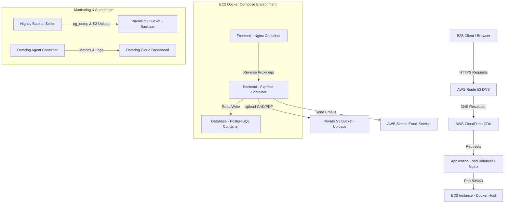

# Architecture Flow - B2B Manufacturing Cloud Platform

This document explains the structural flow of our cloud deployment. Here is the visual flowchart of how users, networks, servers, and data interact.

## 🏗️ Cloud Infrastructure Diagram

---

## 🚦 Request Path Explanation

1. **DNS Resolution**: When a client types `srilaxmiengineering.com`, the request is routed by **Route 53** (AWS DNS service) to find our server's IP.
2. **Nginx Frontend Proxy**: 
   - Requests for pages/images are served directly by Nginx (very fast, uses low memory).
   - Requests targeting `/api/...` are proxy-passed by Nginx into our Node.js container (`backend:3000`).
3. **Database Write**: The backend processes input, and inserts enquiry records into the **PostgreSQL** database container.
4. **Cloud Assets Storage**: Any technical CAD/PDF drawings attached by the user are sent to a private **AWS S3** bucket.
5. **Notifications**: The backend notifies the customer and your sales team using **AWS SES** (Simple Email Service).
6. **Telemetry**: The **Datadog Agent** runs inside its own container, reads Docker host metrics, and streams them to the cloud for real-time monitoring.
