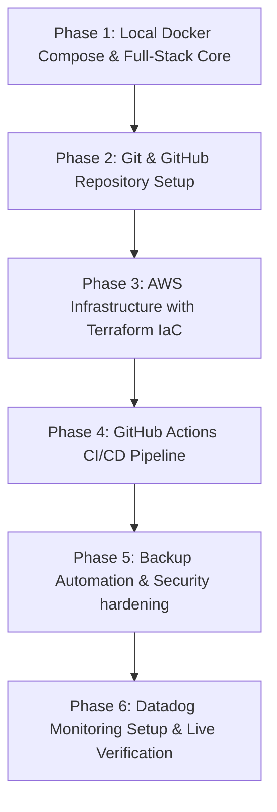

# Roadmap - Sri Laxmi Engineering Works Cloud Platform

Welcome to your DevOps/Cloud Engineering learning journey! This roadmap outlines the steps we will take to turn a basic website into a production-grade full-stack cloud platform.

## 🗺️ The Learning Pathway

---

## 🛠️ Step-by-Step Overview

### Phase 1: Core Full-Stack & Containerization (Current Step)
* **Goal**: Enable database persistence, handle technical drawings upload, and run everything locally in containerized isolation.
* **Key Concepts**: Docker, Docker Compose, PostgreSQL Pools, Multer, AWS SDK.

### Phase 2: Git & GitHub Setup (Next Step)
* **Goal**: Learn version control and create a clean repository to host your DevOps portfolio project.
* **Key Concepts**: Git branches, remote origins, SSH keys, repository structures.

### Phase 3: Infrastructure as Code (IaC) with Terraform
* **Goal**: Build your AWS cloud infrastructure automatically from text scripts.
* **Key Concepts**: VPC, Security Groups, EC2 provisioning, S3 bucket security, IAM Roles.

### Phase 4: Automated Deployment (CI/CD)
* **Goal**: Commit code to GitHub and see it automatically deploy to AWS in seconds.
* **Key Concepts**: GitHub Actions, YAML syntax, runner agents, SSH deployment, container rolling updates.

### Phase 5: Automated Backups & Compliance
* **Goal**: Create automated night-time data backups sent to the cloud.
* **Key Concepts**: Cron jobs, Bash scripting, pg_dump database exports, GDPR controls.

### Phase 6: Monitoring & Metrics
* **Goal**: Track system health, check logs, and set up alert notifications when the site goes down.
* **Key Concepts**: Datadog Agent, Docker system metrics, logging aggregates.
